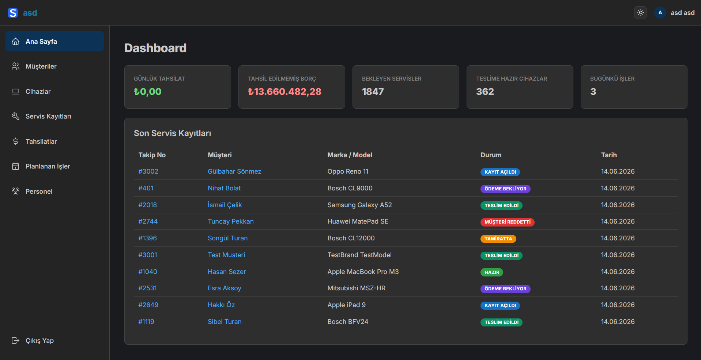
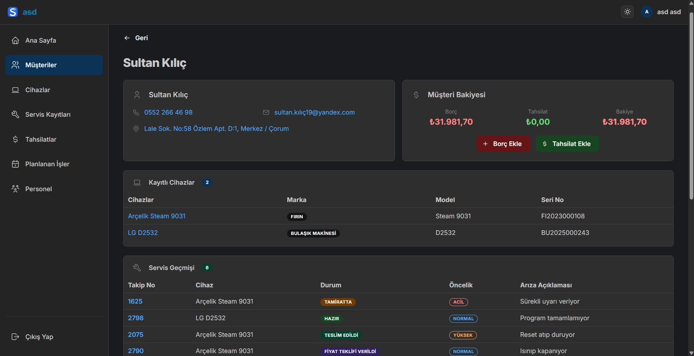
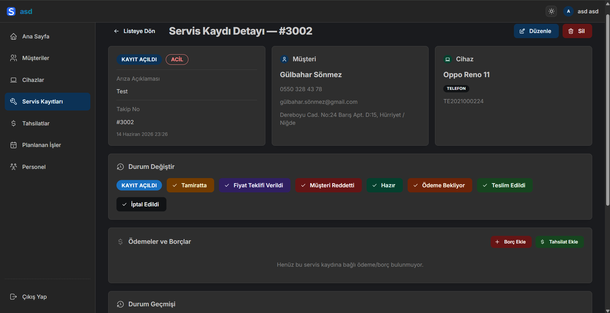
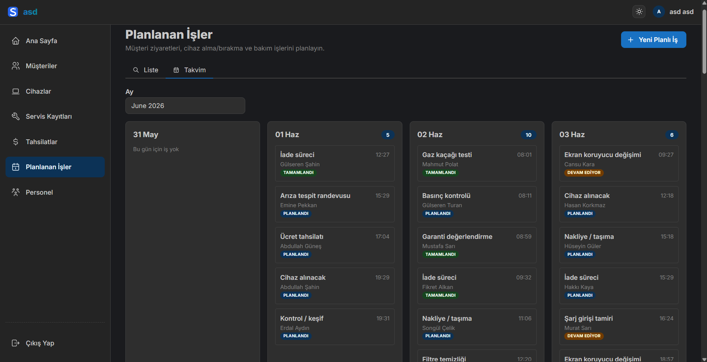

<div align="center">

# 🛠️ Servis Takip

**Teknik ekipler ve servis işletmeleri için self-hosted müşteri, cihaz, arıza/servis kaydı, planlı iş takibi ve tahsilat yönetim platformu.**

[](https://nextjs.org/)
[](https://mantine.dev/)
[](https://www.prisma.io/)
[](https://www.postgresql.org/)
[](https://www.docker.com/)

[Özellikler](#-özellikler) · [Docker Dağıtımı](#-docker-ile-dağıtım) · [Ortam Değişkenleri](#-ortam-değişkenleri) · [İlk Kurulum](#-ilk-kurulum) · [Geliştirme](#-geliştirme-ve-katkı)

</div>

---

## 👀 Neden Servis Takip?

Servis Takip, teknik servis operasyonlarınızı tek bir panoda toplar. Müşterilerinizin servis geçmişini, tahsilat durumlarını ve planlanmış saha görevlerinizi kolayca izlemenizi sağlar. **Verileriniz tamamen kendi sunucunuzda tutulur ve kontrolü sizdedir.**

---

## 📸 Ekran Görüntüleri

|  |  |
| :---: | :---: |
| **Ana Kontrol Paneli (Dashboard)** | **Müşteri Detay Sayfası** |

|  |  |
| :---: | :---: |
| **Servis Kaydı Detayı & Zaman Tüneli** | **Planlanan İşler (Ajanda)** |

---

## ✨ Özellikler

### 👥 Müşteri Yönetimi
*   Müşteri bilgilerini, bağlı cihazları, borç/alacak bakiyelerini tek sayfada izleyin.
*   Detaylı arama ve filtreleme seçenekleriyle kayıtlara hızlıca ulaşın.

### 📟 Cihaz Takibi
*   Marka, model, seri numarası bazında cihaz envanterini müşterilerle eşleştirerek yönetin.
*   Bir cihazın hangi arızalarla ne zaman servis aldığını geçmişe dönük görüntüleyin.

### 🔧 Servis Kayıtları & Arıza Takibi
*   Aşağıdaki iş akışına göre yönetilen durum yapısı:
    ```
    📥 Kayıt Açıldı → 🔧 Tamiratta → 💰 Fiyat Teklifi Verildi → ✅ Hazır → 📦 Teslim Edildi
                        ↘ 🚫 İptal          ↘ 👎 Müşteri Reddetti    ↘ ⏳ Ödeme Bekliyor
    ```
*   Takip numarası (tracking no) ile hızlı arama.
*   Müşteriye açık/kapalı teknisyen notları ve kronolojik durum geçmişi (Timeline).

### 💳 Bakiye & Tahsilat Yönetimi
*   Müşteri bazında güncel borç ve tahsilat takibi.
*   Nakit, Havale/EFT veya Kredi Kartı gibi farklı ödeme yöntemleriyle tahsilat girişi.
*   Finansal durumları anlık izleyebileceğiniz Dashboard grafikleri ve özetleri.

### 📅 Planlı İşler (Ajanda)
*   Cihaz teslim alma, sahada bakım, kurulum vb. randevularınızı takvim üzerinde planlayın.
*   Teknisyen atamaları ve durum takibi ile iş gücünü verimli yönetin.

### 👮 Rol Yetkilendirme
*   **Yönetici (Admin):** Tüm sisteme, ayarlara ve personel yönetimine tam erişim.
*   **Teknisyen:** Müşteri, cihaz ve servis kayıtlarını düzenleyebilir; personel/şirket ayarlarına erişemez.

---

## 🐳 Docker ile Dağıtım

Servis Takip uygulamasını Docker ve Docker Compose kullanarak kendi sunucunuzda kolayca çalıştırabilirsiniz.

### Docker Compose ile Kurulum

Proje kök dizinindeki `docker-compose.yml` dosyasını kullanarak uygulamayı yerel veritabanınıza bağlı şekilde derleyip başlatabilirsiniz:

```yaml
services:
  app:
    build: .
    ports:
      - "3000:3000"
    env_file: .env
    restart: unless-stopped
```

1. Önce `.env` dosyanızı oluşturup gerekli değişkenleri (`DATABASE_URL`, `JWT_SECRET`) tanımlayın.
2. Ardından aşağıdaki komutla konteyneri derleyip arka planda başlatın:

```bash
docker compose up --build -d
```

---

## 📝 Ortam Değişkenleri

Uygulamayı çalıştırırken kullanabileceğiniz yapılandırma seçenekleri:

| Değişken | Açıklama | Varsayılan | Zorunlu mu? |
| :--- | :--- | :--- | :--- |
| `DATABASE_URL` | PostgreSQL bağlantı adresi (örn. `postgresql://...`) | - | ✅ Evet |
| `JWT_SECRET` | Oturum doğrulama için en az 32 karakterlik anahtar | - | ✅ Evet |
| `PORT` | Uygulamanın dinleyeceği port numarası | `3000` | Hayır |
| `NEXT_PUBLIC_APP_URL` | Uygulamanın çalıştığı dış adres (örn: `https://servis.firma.com`) | `http://localhost:3000` | Hayır |

---

## 🚀 İlk Kurulum

Uygulama başarıyla başlatıldıktan sonra tarayıcınızdan `http://localhost:3000` adresine gidin.

1.  Veritabanında hiçbir kullanıcı bulunamadığında sistem sizi otomatik olarak **İlk Kurulum (`/setup`)** ekranına yönlendirir.
2.  Buradan **Şirket Adı**, **Yönetici E-postası**, **Ad/Soyad** ve şifrenizi belirleyin.
3.  Kurulumu tamamladıktan sonra giriş yaparak uygulamayı kullanmaya başlayabilirsiniz.

---

## 💻 Geliştirme ve Katkı

Projeyi yerel bilgisayarınızda çalıştırmak, kod yapısını incelemek ve katkıda bulunmak için lütfen [**CONTRIBUTING.md**](CONTRIBUTING.md) dosyasını inceleyin.

---

<div align="center">

**Servis Takip** — Verileriniz size ait, güvende kalın. 🛡️

</div>
